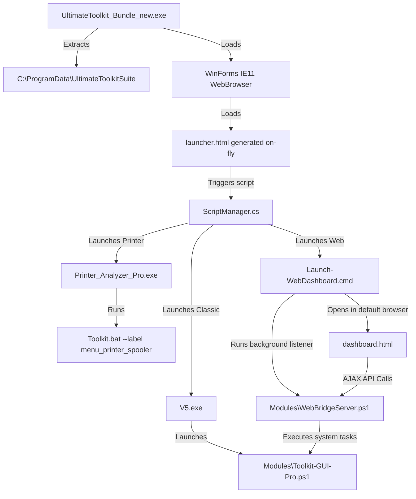

# Repository Analysis Report - Akash Toolkit

This report provides a comprehensive breakdown of the files, dependencies, entry points, and directory structure of the **Akash Toolkit** repository.

---

## Directory Structure

```text
akash_toolkitV7/
├── .antigravityignore
└── tool/
    ├── agents.md
    └── UltimateToolkit_Bundle_new/
        ├── UltimateToolkit_Bundle_new.sln
        ├── UltimateToolkit_Bundle_new.csproj
        ├── Program.cs
        ├── LauncherForm.cs
        ├── LauncherForm.Designer.cs
        ├── ScriptManager.cs
        ├── app.manifest
        ├── dashboard.html
        ├── Launch-WebDashboard.cmd
        ├── Toolkit.bat
        ├── StagingZip
        ├── StagingZip_decrypted.zip
        ├── V5.exe
        ├── Printer_Analyzer_Pro.exe
        ├── Assets/
        │   ├── banner.png
        │   ├── hero.png
        │   ├── README.txt
        │   ├── superhero_cyber_wallpaper.png
        │   └── UltimateToolkit.ico
        ├── Config/
        │   ├── ai_key.txt
        │   ├── custom_bundle.txt
        │   ├── custom_winget_apps.bundle
        │   ├── favorites.bundle
        │   ├── gemini_api.key
        │   ├── gui.catalog
        │   ├── gui_settings.cfg
        │   ├── install_history.log
        │   ├── SystemTwin.json
        │   └── tools.catalog
        ├── Docs/
        │   ├── Add-Portable-Software-Guide.md
        │   ├── AllLabels.txt
        │   ├── BatchFilesAudit.md
        │   ├── FolderStructure.txt
        │   ├── GUI-Pro-Audit.md
        │   ├── GUI-Pro-Guide.md
        │   ├── LabelAudit.md
        │   ├── MenuMap.md
        │   ├── OptionAudit.csv
        │   └── OptionAudit.md
        └── Modules/
            ├── BatteryReport.cmd
            ├── GUI-SelfRepair.ps1
            ├── OneClickSuperRepair.ps1
            ├── PortableToolsMenu.cmd
            ├── SelfHeal-Watchdog.ps1
            ├── SystemInventory.cmd
            ├── SystemInventoryReport.ps1
            ├── Toolkit-GUI-Pro.ps1
            ├── ToolkitReportCenter.ps1
            ├── Web-Dashboard.ps1
            ├── WebBridgeServer.ps1
            ├── Win11Debloat.ps1
            └── web_assets/
                └── index.html
```

---

## Entry Points

### 1. Launcher GUI (Primary Entry Point)
* **File:** `tool\UltimateToolkit_Bundle_new\UltimateToolkit_Bundle_new.csproj` (compiles to executable)
* **Description:** A WinForms wrapper hosting a `WebBrowser` control. It extracts the encrypted `StagingZip` assets into `C:\ProgramData\UltimateToolkitSuite` and displays a suite selection dashboard allowing the user to select their desired interface.
* **Script Interfaces:** Exposes C# methods via `ScriptManager.cs` to the hosted webpage so the browser context can call native GUI methods.

### 2. Command Line Toolkit
* **File:** [Toolkit.bat](../tool/UltimateToolkit_Bundle_new/Toolkit.bat)
* **Description:** A massive batch script containing 37 distinct categories of repair, diagnostic, and optimization tools. It supports command-line arguments to directly jump to specific menu labels.

### 3. Web Console Bridge Server
* **File:** [Launch-WebDashboard.cmd](../tool/UltimateToolkit_Bundle_new/Launch-WebDashboard.cmd)
* **Description:** Relaunches itself as Administrator, stops any existing bridge servers running on port 9999, opens a local HTTP listener on port 9999 by executing `Modules\WebBridgeServer.ps1`, and launches `http://localhost:9999/dashboard.html` in the user's default browser.

---

## Dependency Map



---

## Component Breakdown

1. **Launcher GUI:** WinForms C# wrapper project providing directory extraction (`Program.cs`), UI window parameters (`LauncherForm.cs`), and HTML browser interaction APIs (`ScriptManager.cs`).
2. **Classic WinForms GUI (`Toolkit-GUI-Pro.ps1`):** A massive PowerShell Windows Forms script that implements a standalone, native UI interface with custom themes, search functionality, backup centers, and repair engines.
3. **Web Dashboard (`dashboard.html` & `WebBridgeServer.ps1`):** An immersive cyberpunk web-based console dashboard displaying live charts, process lists, logs, and a chatbot assistant. The bridge server provides the backend REST APIs.
4. **Command CLI (`Toolkit.bat`):** The legacy interactive text command console offering direct control over all diagnostic categories.
5. **Self-Repair Engine (`GUI-SelfRepair.ps1`):** A diagnostic script that monitors and parses WinForms UI errors and uses Google Gemini API to automatically fix code bugs in the script itself.
